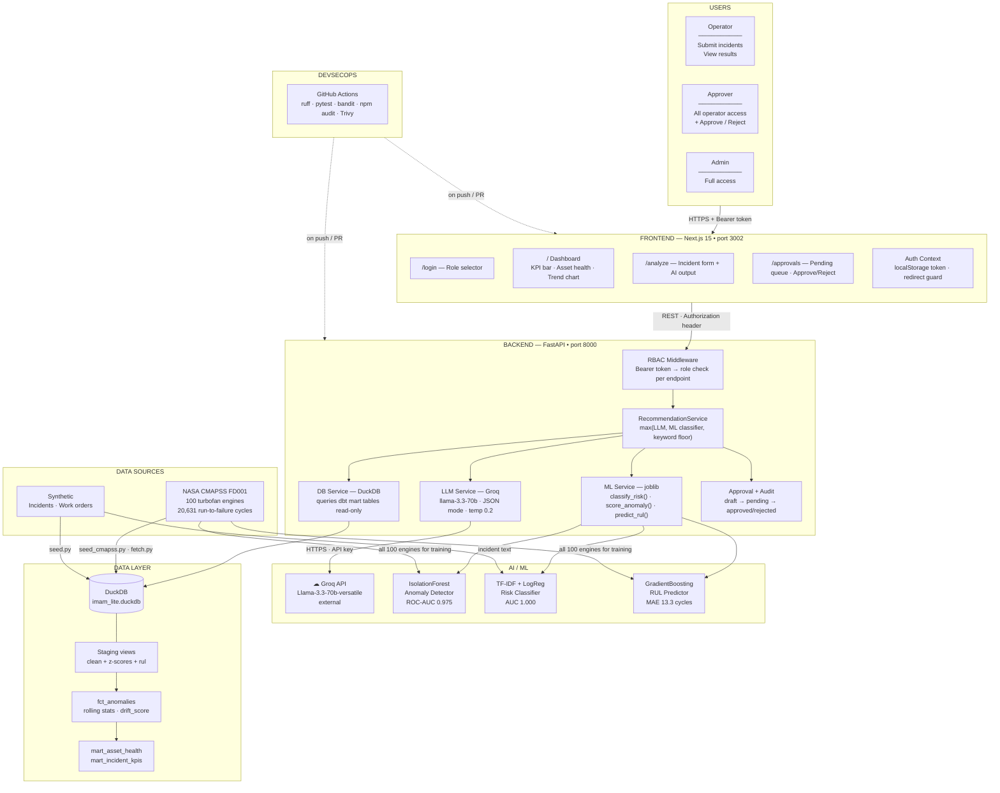

# FORGE — Industrial Maintenance Co-Pilot

> AI-powered maintenance co-pilot for industrial assets. Detects sensor anomalies from real NASA degradation data, classifies incident risk with three independent ML signals, and generates explainable recommendations via LLM — with a role-gated human approval workflow for high-risk actions.


---

## Real-World Scenario — Bharat Forge, Pune

> *This is the exact problem FORGE is built to solve.*

**Plant:** Bharat Forge Ltd, Mundhwa, Pune — Forging Division  
**Asset:** 6,000-ton hydraulic forging press `PRESS-601`  
**Production context:** Manufacturing front axle beams for TATA LPT 2518 commercial trucks, running three shifts, 22 hours/day

---

**The situation:**

It is 02:40 on a Tuesday. The night-shift operator, Ramesh, notices that the hydraulic fluid temperature on PRESS-601 has been climbing slowly — 74°C at shift start, now at 89°C. Vibration on the main ram bearing has also ticked up from 3.1 mm/s to 5.8 mm/s over the last four hours. The press is mid-run on a batch of 240 axle beams. There are 80 pieces left.

Ramesh has three choices:
1. Stop the press now, flag it for maintenance, lose the batch
2. Finish the batch and log it in the paper register for the morning shift to deal with
3. Ask FORGE

---

**What FORGE does:**

Ramesh opens the Analyze page, selects `PRESS-601`, and types:

> *"Hydraulic temp rising from 74 to 89°C over 4 hours. Ram bearing vibration at 5.8 mm/s, was 3.1 at shift start. No alarm triggered yet. 80 pieces left on current batch."*

FORGE runs three signals in parallel:

| Signal | Output |
|---|---|
| **ML Anomaly Detector** (IsolationForest, trained on NASA CMAPSS turbofan degradation) | Anomaly score **0.81** — hydraulic temperature drift matches early-stage bearing degradation curve |
| **LLM** (Groq Llama-3.3-70b) | Risk score **0.74** — elevated temp + vibration together indicate oil viscosity breakdown or bearing cage wear; recommends controlled shutdown |
| **ML Risk Classifier** (TF-IDF + LogReg, trained on incident corpus) | P(high-risk) = **0.79** |

**Final risk score: max(0.81, 0.74, 0.79) = 0.81 → HIGH → `pending_approval`**

The system generates three ranked actions:

1. **Controlled press stop after current stroke** — do not abandon mid-cycle (hydraulic pressure spike risk). Confidence 82%
2. **Check hydraulic oil sample for metal particulates** — early bearing cage wear produces Fe particles detectable in oil. Confidence 71%
3. **Inspect and replace ram bearing if particulate count > 150 ppm** — bearing MTBF at this vibration level is 18–30 hours. Confidence 65%

The recommendation hits `pending_approval`. Ramesh cannot act on it alone.

---

**The approval gate:**

At 02:43, a push notification reaches Priya, the on-call maintenance engineer (Approver role). She opens the Approvals page, reads the ranked actions and the LLM reasoning, adds a note — *"confirmed: oil temp sensor reading valid, not a sensor fault — proceed with action 1"* — and approves.

The full decision is audit-logged: actor, timestamp, risk score, LLM reasoning, ML scores, approver note.

Ramesh completes the current stroke, stops the press safely, and tags it for bearing inspection. The bearing is replaced by 06:00. Morning shift starts on time.

**Without FORGE:** Ramesh either shuts down on instinct (conservative, loses the batch and gets pushback) or finishes the run (aggressive, risks a catastrophic bearing failure mid-cycle — 6,000 tons of force, a seized press, and a possible die crack costing ₹18 lakh and three days of downtime).

**With FORGE:** A junior operator, at 3 AM, makes the right call — backed by AI, validated by an engineer, documented for compliance.

---

## Architecture



---

## ML Pipeline

Three independent risk signals. **The maximum always wins** — safety systems must be pessimistic:

```
Incident text ──► TF-IDF + LogReg ─────────────────► P(high-risk) ─────┐
                                                                         ├──► max() ──► risk_score
Incident text ──► Groq LLM (JSON mode) ────────────► risk_score ────────┤
                  llama-3.3-70b-versatile                                 │
                                                                         │
Keyword scan  ──► safety floor                                           │
                  "bypass"/"interlock" → 0.90 ───────────────────────────┘
                  "fire"/"rupture"/... → 0.70

Sensor readings ──► per-asset z-score ──► IsolationForest ──► anomaly_score (0–1)
                    (temperature, vibration, pressure)

Raw sensors ──► GradientBoosting ──► RUL prediction (cycles remaining)
               14 CMAPSS channels
```

| Model | Input | Training Data | Metric |
|---|---|---|---|
| IsolationForest | z-scored sensor readings | NASA CMAPSS FD001 — real degradation | **ROC-AUC 0.975** |
| TF-IDF + LogisticRegression | Incident text | 180 labeled descriptions | **AUC 1.000** |
| GradientBoosting RUL | 14 CMAPSS sensor channels | All 100 FD001 engines, 20,631 cycles | **MAE 13.3 cycles** |

### Why NASA CMAPSS?

CMAPSS (Commercial Modular Aero-Propulsion System Simulation) is a NASA dataset of 100 turbofan engines each run to failure. It provides real, continuous degradation signals — temperature rise, pressure drift, speed variance — that map directly to industrial machinery behaviour. Training on real run-to-failure curves gives the anomaly detector patterns that synthetic Gaussian noise cannot replicate.

---

## Stack

| Layer | Technology |
|---|---|
| **API** | FastAPI 0.115, Pydantic v2, PyJWT |
| **LLM** | Groq — `llama-3.3-70b-versatile` (JSON mode, temp 0.2) |
| **ML** | scikit-learn 1.6 — IsolationForest, TF-IDF/LR, GradientBoosting |
| **Data warehouse** | DuckDB 1.2 |
| **Transformations** | dbt-core 1.9 + dbt-duckdb |
| **Real-world data** | NASA CMAPSS FD001 — 20,631 turbofan degradation cycles |
| **Frontend** | Next.js 15, React 19, light workhorse theme |
| **Auth** | RBAC — operator / approver / admin, JWT + demo tokens |
| **CI** | GitHub Actions — ruff, pytest, bandit, npm audit, Trivy |
| **Runtime** | Python 3.12 (mise), Node 20 |

---

## Quickstart

### Prerequisites
- [mise](https://mise.jdx.dev/) for Python 3.12
- Node 20+

### Setup

```bash
git clone https://github.com/Rancidcake/IMAMSmith
cd IMAMSmith

# Python environment
mise install
mise exec -- python -m venv .venv
.venv/bin/pip install -r apps/api/requirements.txt
.venv/bin/pip install -r ml/requirements.txt

# Node
cd apps/web && npm install && cd ../..

# Secrets
cp .env.example .env
# → set GROQ_API_KEY in .env
```

### Data + ML pipeline

```bash
# Option A — with real NASA CMAPSS data (recommended)
make cmapss-pipeline
# Downloads CMAPSS → seeds DuckDB (synthetic base + real sensor readings)
# → dbt run → trains all 3 ML models

# Option B — synthetic data only (no network required)
make pipeline
```

### Run

```bash
# API (must run from repo root so .env is found)
PYTHONPATH=apps/api .venv/bin/uvicorn app.main:app --host 0.0.0.0 --port 8000

# Web (separate terminal)
cd apps/web && npm run dev -- --port 3002
```

Open `http://localhost:3002` → select a role on the login page → explore.

**Demo tokens (no password):**

| Role | Can do |
|---|---|
| `operator` | Dashboard, submit incident analysis, view approval queue (read-only) |
| `approver` | All of above + approve / reject high-risk recommendations |
| `admin` | Full access |

---

## API Endpoints

| Method | Path | Role | Description |
|---|---|---|---|
| `GET` | `/health` | public | Liveness check |
| `POST` | `/incidents/analyze` | operator | LLM + ML risk analysis → recommendation |
| `GET` | `/recommendations/` | operator | List all recommendations |
| `POST` | `/recommendations/{id}/approve` | approver | Approve or reject |
| `GET` | `/recommendations/{id}/audit` | approver | Full audit trail |
| `GET` | `/analytics/asset-health` | operator | Per-asset health scores + RUL |
| `GET` | `/analytics/kpis` | operator | Daily incident KPIs + summary |

Interactive docs: `http://localhost:8000/docs`

---

## Project Layout

```
IMAMSmith/
├── apps/
│   ├── api/                       FastAPI backend
│   │   └── app/
│   │       ├── core/              Config, JWT auth, RBAC
│   │       ├── routers/           incidents, assets, recommendations, analytics
│   │       ├── schemas/           Pydantic models
│   │       └── services/          llm_service, ml_service, db_service, audit
│   └── web/                       Next.js 15 frontend
│       └── src/
│           ├── app/               Dashboard · Analyze · Approvals · Login pages
│           ├── components/        HeaderClient (role badge)
│           └── lib/               api.ts · auth.tsx · types.ts
├── data/
│   ├── cmapss/
│   │   ├── fetch.py               Downloads NASA CMAPSS files
│   │   └── seed_cmapss.py         Maps engines → assets, loads DuckDB
│   └── synthetic/seed.py          Generates incidents + work orders
├── docs/                          ARCHITECTURE.md · PRD · API spec · runbook
├── ml/
│   ├── train.py                   Trains IsolationForest + TF-IDF/LR + GBR
│   └── models/                    Saved .joblib artefacts (gitignored)
├── packages/
│   ├── dbt/                       dbt project — staging → facts → marts
│   └── policies/                  Compliance rule YAML
├── .github/workflows/ci.yml       GitHub Actions CI
├── Makefile                       pipeline · cmapss-pipeline · lint · test · scan
└── docker-compose.yml
```

---

## Compliance Rules

Enforced at inference time — injected into the LLM system prompt and checked in `recommendation_service.py`:

| Rule | Trigger | Effect |
|---|---|---|
| OEM-INT-001 | "bypass" or "interlock" in incident text | Risk floor → **0.90**, violation added |
| ASME-PRESS-002 | Pressure boundary restart scenario | LLM instructed to cite rule in rationale |
| API-INSPECT-003 | Inspection or checklist reference | LLM instructed to cite rule in rationale |

---

## DevSecOps

```
Every push / PR triggers GitHub Actions:

  api job   → ruff lint → pytest → bandit SAST
  web job   → eslint → npm audit --audit-level=high
  container → docker build → trivy image scan (CRITICAL/HIGH, fail on unfixed)

Pre-commit (local):
  detect-private-key · detect-secrets · ruff · bandit
```

```bash
make lint    # ruff + eslint
make test    # pytest
make scan    # bandit + npm audit + trivy
```

---

## Why FORGE vs the competition

| Product | Gap vs FORGE |
|---|---|
| **IBM Maximo + Watson** | Months to deploy, six-figure cost. LLM recommendations are black-box, no rationale, no approval gate. |
| **C3.ai Predictive Maintenance** | Requires a data lake and cloud infra. ML scores only — no explainability, no compliance enforcement. |
| **Aspen APM (Meridium)** | Heavy process-industry focus, rule-based recommendations, expensive per-seat licensing. |
| **Augury** | Vibration-only sensors. No document ingestion, no LLM reasoning, no approval workflow. |
| **SAP PM + AI** | Locked to SAP ERP. No open architecture. Extremely slow to deploy. |

**What FORGE does differently:**
1. **Fused scoring** — three independent signals, maximum wins. One model can't suppress a high-risk signal.
2. **Explainability first** — every recommendation has ranked actions, rationale text, confidence scores, and evidence links.
3. **Compliance at inference time** — OEM interlock and ASME pressure rules checked on every recommendation before it leaves the service.
4. **Built-in approval gate** — high-risk recommendations enter `pending_approval`, locked until an approver signs off. Fully audited.
5. **Real degradation data** — trained on NASA CMAPSS run-to-failure cycles, not synthetic Gaussian noise.
6. **Lightweight** — runs on a single DuckDB file, FastAPI, and Next.js. Full pipeline in under two minutes on a laptop.

---

## License

Copyright (c) 2025 Rancidcake. All Rights Reserved.  
Proprietary and confidential. Viewing permitted for evaluation only. See [LICENSE](LICENSE).
