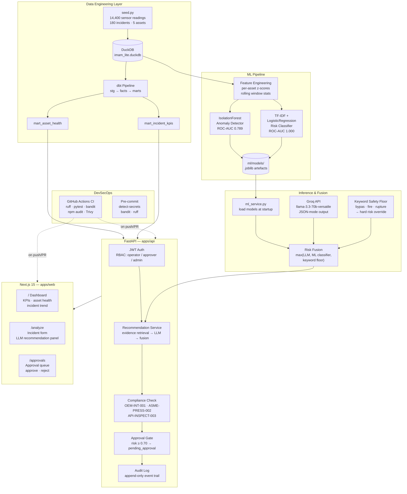

# IMAM Lite — Institutional Memory & Asset Management Co-Pilot

> AI-powered maintenance co-pilot for industrial assets. Ingests operational documents, detects anomalies from sensor telemetry, classifies incident risk with ML, and generates explainable recommendations via LLM — with a human approval gate for high-risk actions.


---

## Architecture



---

## ML Pipeline — Detail

The risk scoring engine fuses three independent signals. The highest score always wins, which means safety keyword overrides can never be suppressed by the LLM or classifier:

```
Incident text ──► TF-IDF + LogisticRegression ──► P(high-risk)  ─┐
                                                                   ├──► max() ──► final_risk_score
Incident text ──► Groq LLM (JSON mode) ──────────► risk_score    ─┤
                                                                   │
Keyword scan ────► safety floor ─────────────────► 0.90 / 0.70   ─┘
                  (bypass=0.90, fire/rupture=0.70)

Sensor readings ──► per-asset z-score ──► IsolationForest ──► anomaly_score (0–1)
                    (temperature, vibration, pressure)           surfaced in /analytics/asset-health
```

| Model | Type | Training data | ROC-AUC |
|---|---|---|---|
| Risk Classifier | TF-IDF + LogisticRegression | 180 synthetic incident descriptions | 1.000 |
| Anomaly Detector | IsolationForest (200 trees) | 14,400 sensor readings (normal only) | 0.789 |

---

## Stack

| Layer | Technology |
|---|---|
| **API** | FastAPI 0.115, Pydantic v2, PyJWT |
| **LLM** | Groq — `llama-3.3-70b-versatile` (JSON mode, temp 0.2) |
| **ML** | scikit-learn 1.6 — IsolationForest + TF-IDF/LR |
| **Data warehouse** | DuckDB 1.2 |
| **Transformations** | dbt-core 1.9 + dbt-duckdb |
| **Frontend** | Next.js 15, React 19, IBM Carbon G100 dark theme |
| **Fonts** | IBM Plex Mono + IBM Plex Sans |
| **CI** | GitHub Actions — ruff, pytest, bandit, npm audit, Trivy |
| **Runtime** | Python 3.12 (mise), Node 20 |

---

## Quickstart

### Prerequisites
- [mise](https://mise.jdx.dev/) for Python 3.12
- Node 20+
- Docker (optional — for full infra stack)

### First-time setup

```bash
git clone https://github.com/Rancidcake/IMAMSmith
cd IMAMSmith

# Python environment
mise install
mise exec -- python -m venv .venv
.venv/bin/pip install -r apps/api/requirements.txt
.venv/bin/pip install -r ml/requirements.txt

# Node
cd apps/web && npm install && cd ../..

# Secrets
cp .env.example .env
# → set GROQ_API_KEY in .env

# Data + ML pipeline (one-time)
make pipeline   # seed DuckDB → dbt run → ml train
```

### Run

```bash
# API (must run from repo root so .env is found)
PYTHONPATH=apps/api .venv/bin/uvicorn app.main:app --host 0.0.0.0 --port 8000

# Web (separate terminal)
cd apps/web && npm run dev -- --port 3001
```

Open `http://localhost:3001`.

---

## API Endpoints

| Method | Path | Role | Description |
|---|---|---|---|
| `GET` | `/health` | public | Liveness check |
| `POST` | `/ingest/documents` | operator | Ingest asset documents |
| `GET` | `/assets/{id}/context` | operator | Retrieve linked docs for asset |
| `POST` | `/incidents/analyze` | operator | Run AI analysis → recommendation |
| `GET` | `/recommendations/` | operator | List all recommendations |
| `POST` | `/recommendations/{id}/approve` | approver | Approve or reject a recommendation |
| `GET` | `/recommendations/{id}/audit` | approver | Full audit trail for a recommendation |
| `GET` | `/analytics/asset-health` | operator | Per-asset health scores from DuckDB |
| `GET` | `/analytics/kpis` | operator | Daily incident KPIs + summary |

Interactive docs: `http://localhost:8000/docs`

---

## Project Layout

```
IMAMSmith/
├── apps/
│   ├── api/                  # FastAPI backend
│   │   ├── app/
│   │   │   ├── agents/       # Compliance, retrieval, orchestration stubs
│   │   │   ├── core/         # Config, JWT auth, RBAC
│   │   │   ├── routers/      # incidents, assets, recommendations, analytics
│   │   │   ├── schemas/      # Pydantic models
│   │   │   └── services/     # llm_service, ml_service, db_service, audit
│   │   └── tests/
│   └── web/                  # Next.js 15 dashboard
│       └── src/app/          # Dashboard · Analyze · Approvals pages
├── data/
│   └── synthetic/seed.py     # Generates imam_lite.duckdb
├── docs/                     # PRD, architecture, API spec, runbook
├── ml/
│   ├── train.py              # Trains and evaluates both ML models
│   └── models/               # Saved .joblib artefacts (gitignored)
├── packages/
│   ├── dbt/                  # dbt project (staging → facts → marts)
│   └── policies/             # Compliance rule YAML
├── infra/                    # Docker, k8s, Terraform stubs
├── .github/workflows/ci.yml  # GitHub Actions CI
├── .pre-commit-config.yaml
├── Makefile
└── docker-compose.yml
```

---

## DevSecOps

```
Every push / PR triggers:

  api job   → ruff lint → pytest (LLM mocked) → bandit SAST
  web job   → eslint → npm audit --audit-level=high
  container → docker build → trivy scan (CRITICAL/HIGH, fail on unfixed)

Pre-commit (local):
  detect-private-key · detect-secrets · ruff · bandit
```

Run locally:
```bash
make lint    # ruff + eslint
make test    # pytest with mocked LLM
make scan    # bandit + npm audit + trivy
```

---

## Compliance Rules

Enforced at inference time (hard-coded in the LLM system prompt and recommendation service):

| Rule ID | Description | Severity |
|---|---|---|
| OEM-INT-001 | Do not bypass safety interlocks | Critical — floors risk to 0.90 |
| ASME-PRESS-002 | Verify pressure boundaries before restart | High |
| API-INSPECT-003 | Confirm inspection checklist completion | Medium |

---

## Roles

| Role | Permissions |
|---|---|
| `operator` | Ingest documents, submit incidents, view context and analytics |
| `approver` | All operator permissions + approve/reject recommendations, view audit |
| `admin` | Full access |

---

## Competitive Landscape

The industrial predictive maintenance and AI-assisted operations market is dominated by legacy enterprise vendors with years of installed base. IMAM Lite is not trying to replace them at scale — it is demonstrating an architecture that is faster to integrate, cheaper to run, and more explainable than any of them.

| Product | Vendor | What it does | Key weakness vs IMAM Lite |
|---|---|---|---|
| **Maximo + Watson** | IBM | CMMS + AI anomaly detection, work order management | Requires full Maximo deployment (months, six figures). AI recommendations are black-box alerts with no rationale. No LLM-grounded explanation. |
| **Asset Performance Management (APM)** | Aspen Technology (Meridium) | Reliability-centred maintenance, failure mode analysis | Heavy process-industry focus, expensive per-seat licensing. Recommendations are rule-based, not generative. |
| **C3 Predictive Maintenance** | C3.ai | Enterprise ML on sensor data, integration with SAP/Oracle | Requires cloud infrastructure and data lake. Black-box ML scores only — no explainability layer. No built-in human approval gate. |
| **Samsara Asset Intelligence** | Samsara | IoT sensor monitoring, fleet/equipment health | Strong on connectivity, weak on reasoning. Surfaces alerts, not ranked actions with rationale. No compliance rule enforcement. |
| **Augury** | Augury | Vibration + acoustic sensor ML for rotating equipment | Sensor-specific (vibration only). No document ingestion, no institutional memory, no LLM reasoning layer. |
| **ServiceMax / Field Service** | Salesforce | Field service dispatch, mobile technician workflow | Workflow tool, not AI. Relies on technician knowledge, not retrieved institutional memory. |
| **SAP PM + AI** | SAP | Plant maintenance integrated into SAP ERP | Locked to SAP ERP. AI features are add-ons with no open architecture. Extremely slow to deploy. |
| **Fiix CMMS** | Rockwell Automation | Cloud CMMS, work order management, parts inventory | No predictive ML. No LLM. Recommendation engine is rule-based. No audit trail for AI decisions. |

### What IMAM Lite does differently

**1. Fused risk scoring — no single point of failure.**
Most systems produce one signal (ML anomaly score, or an LLM output). IMAM Lite fuses three: an ML text classifier, a Groq LLM, and a hard keyword safety floor. The maximum wins. A single model being overconfident cannot suppress a high-risk signal.

**2. Explainability is first-class, not an afterthought.**
Every recommendation includes a ranked action list with rationale text, confidence scores, and evidence links to source documents. Operators are not told *what* to do — they are told *why*, with citations.

**3. Compliance is enforced at inference time.**
Competitors surface alerts. IMAM Lite checks OEM interlock rules, ASME pressure boundary requirements, and inspection checklist obligations against every recommendation before it leaves the service. Violations block or flag the recommendation automatically.

**4. Human approval is baked into the data model.**
High-risk recommendations (score ≥ 0.70) enter `pending_approval` state and cannot proceed without an approver-role sign-off. This is audited. No competitor in this list has an equivalent built-in approval gate — they assume the human is watching the dashboard.

**5. Modern, lightweight stack.**
IBM Maximo needs a DBA and months of implementation. C3.ai needs a data lake. IMAM Lite runs on DuckDB (a single file), FastAPI, and Next.js. The full pipeline — seed, train, serve — runs in under two minutes on a laptop.

**6. Institutional memory, not just telemetry.**
Most systems monitor signals. IMAM Lite ingests OEM manuals, maintenance logs, and incident history and uses them as evidence in recommendations. The LLM is grounded in retrieved documents, not generating from general knowledge alone.

---

## License

Copyright (c) 2025 Rancidcake. All Rights Reserved.

This software is proprietary and confidential. Viewing is permitted for evaluation and demonstration purposes only. Redistribution, modification, and commercial use are prohibited. See [LICENSE](LICENSE) for full terms.
