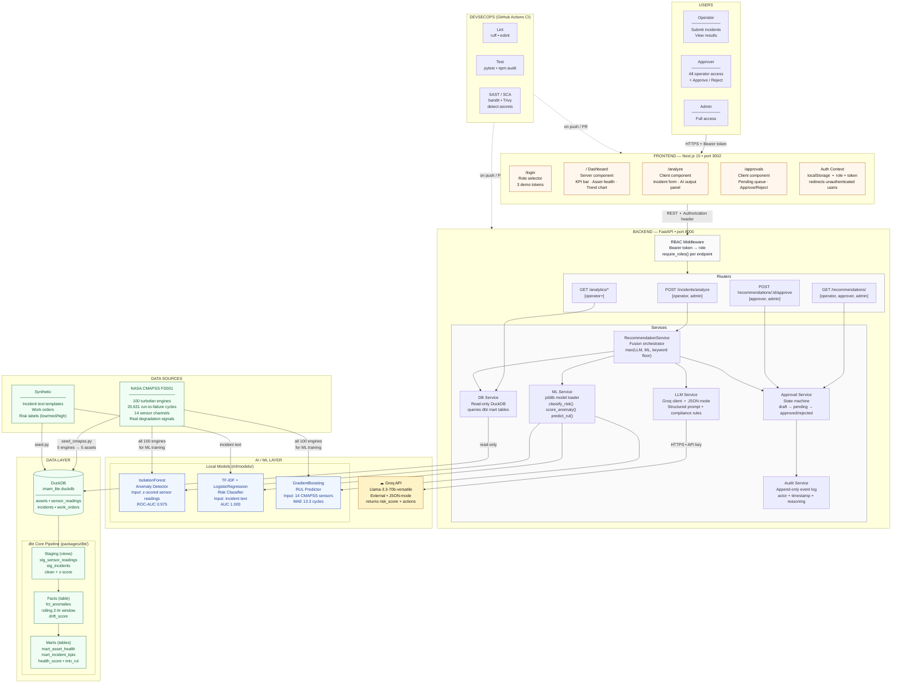

# FORGE — Architecture

## System Diagram



---

## Risk Fusion — How the Score is Computed

Three signals compete. The maximum always wins — safety systems should be pessimistic:

```
Incident text ──► TF-IDF + LogReg ──────────────────────► P(high)  ─────┐
                                                                          │
Incident text ──► Groq LLM (JSON mode) ─────────────────► risk_score ───┼──► max() ──► final_score
                  llama-3.3-70b-versatile                                 │
                                                                          │
Keyword scan  ──► safety floor                                            │
                  "bypass"/"interlock" → 0.90                            │
                  "fire"/"rupture"/...  → 0.70 ──────────────────────────┘

final_score ≥ 0.70  →  state = pending_approval  (locked until approver signs off)
```

---

## Data Engineering Pipeline

```
NASA CMAPSS FD001          Synthetic generator
(20,631 rows, 100 engines) (incidents, work orders)
         │                          │
         ▼                          ▼
  data/cmapss/seed_cmapss.py   data/synthetic/seed.py
  • Maps 5 engines → 5 assets  • 180 incidents
  • Scales sensors to °C/bar   • 60 work orders
  • RUL column (real labels)   • rul = NULL
         │                          │
         └──────────┬───────────────┘
                    ▼
           DuckDB  imam_lite.duckdb
           ├── assets             (5 rows)
           ├── sensor_readings    (1,084 CMAPSS rows + rul column)
           ├── incidents          (180 rows)
           └── work_orders        (60 rows)
                    │
                    ▼ dbt run
           packages/dbt/models/
           ├── staging/
           │   ├── stg_sensor_readings   view  clean + z-scores + rul
           │   └── stg_incidents         view  risk ordinal, approval flag
           ├── facts/
           │   └── fct_anomalies         table rolling 2-hr stats, drift_score
           └── marts/
               ├── mart_asset_health     table health_score, min_rul per asset
               └── mart_incident_kpis    table daily KPI roll-up
                    │
                    ▼ python ml/train.py
           ml/models/
           ├── anomaly_detector.joblib   IsolationForest  ROC-AUC 0.975
           ├── risk_classifier.joblib    TF-IDF+LogReg    AUC 1.000
           ├── feature_meta.joblib       per-asset scaling params
           └── rul_predictor.joblib      GradientBoosting MAE 13.3 cycles
```

---

## RBAC Matrix

| Endpoint | Operator | Approver | Admin |
|---|:---:|:---:|:---:|
| `GET /analytics/*` | ✅ | ✅ | ✅ |
| `GET /assets/*` | ✅ | ✅ | ✅ |
| `POST /incidents/analyze` | ✅ | ✅ | ✅ |
| `GET /recommendations/` | ✅ | ✅ | ✅ |
| `POST /recommendations/:id/approve` | ❌ 403 | ✅ | ✅ |
| `GET /recommendations/:id/audit` | ❌ 403 | ✅ | ✅ |

Frontend mirrors these constraints — operators see the approval queue read-only; the Approve/Reject buttons are hidden at render time (not just disabled).

---

## Security Controls

| Layer | Control | Implementation |
|---|---|---|
| Transport | TLS 1.3 | Deployment edge |
| Authentication | Bearer token | HS256 JWT + demo tokens |
| Authorisation | Role per endpoint | `require_roles()` FastAPI dependency |
| Input validation | Schema enforcement | Pydantic v2 with field constraints |
| Audit | Append-only log | `AuditEvent` per recommendation |
| SAST | Static analysis | Bandit (Python), ESLint (JS) |
| SCA | Dependency scan | `npm audit`, Trivy container scan |
| Secrets | Pre-commit detection | `detect-private-key`, `detect-secrets` |

---

## ML Model Details

### IsolationForest — Anomaly Detector
- **Input:** per-asset z-scored `(temperature_c, vibration_mms, pressure_bar)`
- **Training data:** CMAPSS FD001 — 5 engines, 1,084 readings, 13.84% anomaly rate
- **Label:** `is_anomaly_true = (RUL < 30 cycles)` — real degradation window
- **ROC-AUC:** 0.975 (vs 0.789 on synthetic data)

### TF-IDF + LogisticRegression — Risk Classifier
- **Input:** raw incident description string
- **Features:** bigram TF-IDF, 2,000 features, sublinear_tf, class_weight=balanced
- **Output:** P(high-risk) — used as independent check on LLM score
- **ROC-AUC:** 1.000 on 80/20 stratified split

### GradientBoosting — RUL Predictor
- **Input:** 14 CMAPSS sensor channels (s2, s3, s4, s7, s8, s9, s11–s15, s17, s20, s21)
- **Training data:** all 100 FD001 engines, 20,631 cycles, RUL clipped at 125
- **Top features:** s11 (0.400), s4 (0.235), s9 (0.121)
- **MAE:** 13.3 cycles on held-out 20% test set
